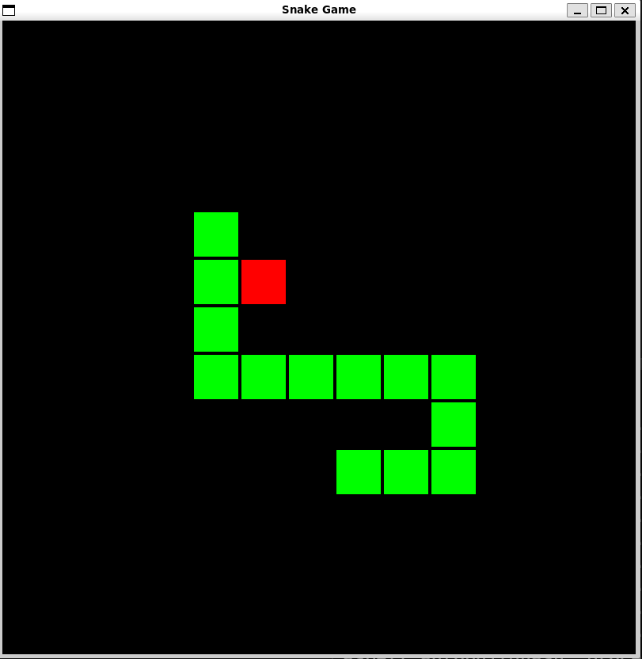
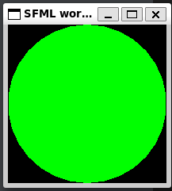

# C++ Assignment 4 - Snake Game (Group Project)

**Complete in groups of 2-4**

To be completed after finishing Chapters 19-23 on [LearnCPP](https://www.learncpp.com/) **with a small group**.

This will be your final project and will have relatively minimal instructions, instead we encourage you to explore the documentation and resources available to you. In order to get the most out of this exercise don't look up the direct solution, instead you should refer to similar examples online.

Problem solving, debugging, and researching are important aspects of programming in any context, and C++ is no different.
Consider trying to tie together as my many topics as you can in this project, to really demonstrate to yourself and the world what you've learned. Try to think about using: Object oriented programming, data structures, libaries, header files, the STL, functions, arrays, pointers, and more!

## Snake Game

In this assignment you will be recreating the classic game `Snake`. You can play a version of it [here](https://patorjk.com/games/snake/) to familiarize yourself with the rules.

A basic description of the goal is as follows:

1. Your snake should start as a fixed length and be controlled by the keyboard.
2. A single food item should be located randomly in the game along the same grid as the snake.
3. If the snake head touches the food, consume the food, lengthen the snake by at least 1, and place the food somewhere else.
4. If the snake touches any part of itself or the walls, the game ends and restarts.

Be sure to test edge cases, such as behavior near the walls, and what happens if the user spams the keyboard.
These are just the basic requirements, feel free to make it personal with custom artwork, adding a score, a menu, etc.

We suggest breaking up the game components between your group members and integrate them together as you are finishing up. But be prepared to fix some bugs as all of your code starts to interact!

Here is an example of a basic C++ snake game:



## Getting started

You should be developing this project locally, and not in Github Codespaces. You can use a Docker container if you'd like, but you will need to install SFML on your local machine.

To get started you first have to figure out how to display a Graphical User Interface (GUI) from C++. Depending on you're environment this setup this will work differently.

We suggest using SFML (Simple Fast Multimedia Library) to display graphics. You can figure out **[how to install the library from their website](https://www.sfml-dev.org/tutorials/2.5/)** or view the various builds [here](https://www.sfml-dev.org/download/sfml/2.6.0/). It can sometimes be challenging to build an application using an external library, but once you've successfully compiled and executed a program once, you should be good for the rest of the project.

The internet is your friend with this project, use your resources to solve problems as they arise, and don't forget to explore the [SFML Documentation](https://www.sfml-dev.org/documentation/2.6.0/).

### Example

Here is the sample program that SFML provides in their tutorials to test if everything is working. You should see a green circle if it works.

```c++
#include <SFML/Graphics.hpp>

int main()
{
    sf::RenderWindow window(sf::VideoMode(200, 200), "SFML works!");
    sf::CircleShape shape(100.f);
    shape.setFillColor(sf::Color::Green);

    while (window.isOpen())
    {
        sf::Event event;
        while (window.pollEvent(event))
        {
            if (event.type == sf::Event::Closed)
                window.close();
        }

        window.clear();
        window.draw(shape);
        window.display();
    }

    return 0;
}
```



### WSL/Linux

If you develop C++ on WSL/Linux you may want to create a makefile to help build your project more easily.

```makefile
build: snake.cpp
	g++ -c snake.cpp
	g++ snake.o -o snake-game -lsfml-graphics -lsfml-window -lsfml-system
```

Also if you use WSL, ensure you've [updated to WSL 2](https://learn.microsoft.com/en-us/windows/wsl/install#upgrade-version-from-wsl-1-to-wsl-2), install [VcXsrv and X11](https://sourceforge.net/projects/vcxsrv/),
and set these environment variables in linux:

```bash
$ export DISPLAY=:0
$ export LIBGL_ALWAYS_INDIRECT=0
```

## Grading

Once you've completed the assignment, you can submit your code for grading by pushing it to GitHub. Edit the first line of this README.md file to indicate you are finished and ready for grading.

Due to the complexity of this assignment, we will be grading it manually. We will be looking for the following:

1. Error free compilation and basic window display without error
1. Snake moves clearly in one direction and length stays constant until food is consumed
1. Snake responds intuitively to arrow keys or WASD
1. Food and snake are clearly indicated by color/design choices
1. Food is placed randomly at the beginning of the game and after each time it is eaten
1. Each food eaten grows the snake uniformly
1. Snake eating itself ends/restarts the game
1. Snake eating wall ends/restarts the game
1. The game is reasonably difficult showing consideration of game scale and FPS
1. Overall playability and resemblance of snake
1. Demonstrates OOP concepts by utilizing classes for Snake and Food
1. Code is organized clearly and logically, with meaningful variable names and uniform style
1. Code is documented with clear and meaningful comments
